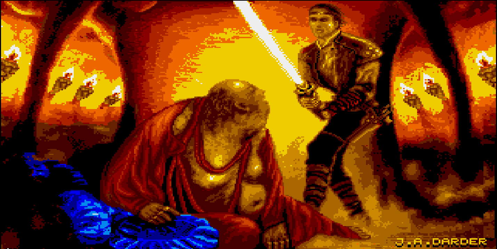
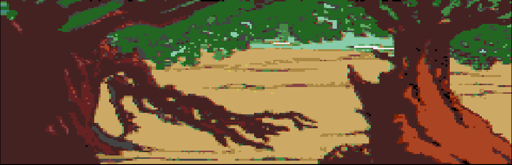
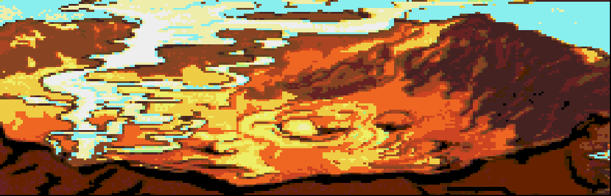
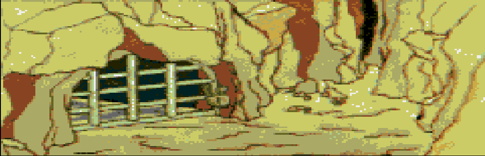
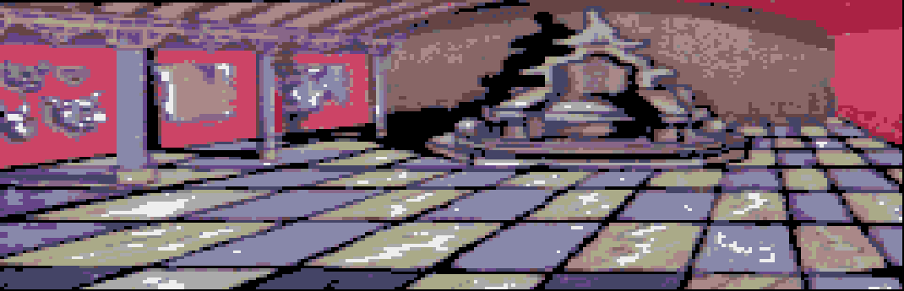
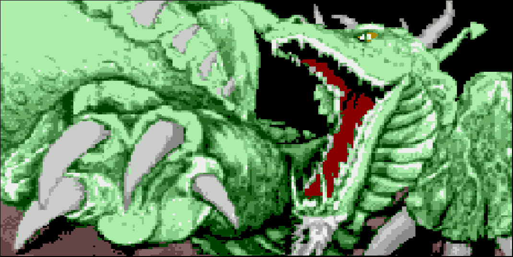

# 🏔️ La Aventura Original

<div align="center">

**Adaptación a [ngPAWS](http://www.ngpaws.com/) de la mítica aventura de Aventuras AD (1989)**

*Versión reducida y en castellano del legendario* ***Advent***

[](./LICENSE)
[](http://www.ngpaws.com/)
[]()
[]()
[]()


[▶️ **Jugar ahora**](https://lao.jim88.de) · [📱 Instalar en móvil](#-instalación) · [📖 Cómo jugar](#-cómo-jugar) · [🎬 Ver entrevista](https://www.youtube.com/watch?v=HLcyTd_QrQs) · [🐛 Reportar fallo](https://github.com/jimraynor88/la-aventura-original-jim-edition/issues)

</div>

---

## 🎮 ¿Qué es?

**La Aventura Original** fue publicada por **Aventuras AD** en 1989. Se trata de
una versión reducida y en castellano del legendario *Advent* (también conocido
como *Colossal Cave Adventure*), el primer videojuego de aventura conversacional
de la historia, escrito originalmente por **Will Crowther** y **Don Woods** en
1976.

Esta edición es una **recreación fiel** sobre el motor
[**ngPAWS**](http://www.ngpaws.com/), con gráficos extraídos de la versión de
**Amiga** e **ilustraciones nuevas** para aquellas localidades que nunca las
tuvieron.

> 💬 **¿Cómo se juega?** Escribe órdenes como `COGE LLAVE`, `ABRE PUERTA` o
> `MIRA` y descubre los secretos de **La Gran Caverna**. Escribe `AYUDA` en
> cualquier momento si te atascas.
>
> 🎬 **¿Quieres saber más?** En el menú `☰ → Acerca de` tienes la
> [entrevista de RetroMadrid 2013](https://www.youtube.com/watch?v=HLcyTd_QrQs)
> a los creadores originales.

---

## 📸 Capturas

<div align="center">

| | | |
|:-:|:-:|:-:|
|  |  |  |
| *Pantalla de inicio* | *Bosque profundo* | *Borde del volcán* |

| | | |
|:-:|:-:|:-:|
|  |  |  |
| *La reja de la caverna* | *Trono de los Reyes Elfos* | *El "bisssssho"* |

</div>

---

## ✨ Características

<table>
<tr>
<td width="50%" valign="top">

### 🕹️ Motor de juego
- 🧠 **Parser en castellano** con sinónimos, pronombres y corrección de erratas
- 🎨 **Gráficos** por localidad, con soporte SVG y PNG
- 🔊 **Sonido** mediante la librería *buzz.js*
- 💾 **Guardado** en `localStorage`
- 🌍 **Dos partes** unidas en una sola aventura continua

</td>
<td width="50%" valign="top">

### 🚀 Edición Jim
- 📱 **Optimizada para móvil** (barra rápida de botones)
- 🎨 **Colores personalizables** por categoría de botón
- 📐 **Botonería acoplada** debajo del texto, ocultable (el texto se expande al ocultarla)
- 🔤 **Tamaño ajustable** de texto, menús y botones
- 💾 **Autoguardado** cada N turnos
- 🗺️ **Mapa automático** de localidades visitadas
- 📤 **Exportar / importar** partidas en `.json`
- 📶 **PWA offline** (Service Worker)
- ☰ **Menú integrado** sin `prompt()` nativo

</td>
</tr>
</table>

---

## 🆕 La Edición Jim

Esta versión añade una capa moderna de interfaz **sin tocar el motor original**.
Todo el código de juego (`code.js`, `code.txp`) permanece intacto; los cambios
viven en `index.html` y en los **módulos externos** `extra-ui.js` y
`extra-dock.js`, que se cargan tras `code.js`.

### 📊 Comparativa

| Función | Original | **Edición Jim** |
|---|:-:|:-:|
| Parser en castellano | ✅ | ✅ |
| Gráficos y sonido | ✅ | ✅ |
| Guardar / Cargar con `prompt()` | ✅ | ✅ |
| Guardar / Cargar con **interfaz propia** | ❌ | ✅ |
| **Autoguardado** periódico | ❌ | ✅ |
| **Exportar / importar** `.json` | ❌ | ✅ |
| **Mapa automático** de localidades | ❌ | ✅ |
| **Transcripción** copiable / descargable | ❌ | ✅ |
| **Barra rápida** táctil de botones | ❌ | ✅ |
| **Botonería acoplada** debajo del texto (ocultable) | ❌ | ✅ |
| **Colores personalizables** por categoría | ❌ | ✅ |
| **Tamaño específico** de la barra rápida | ❌ | ✅ |
| **Filtrado** de salidas fantasma (`SALIDAS`) | ❌ | ✅ |
| **Ajuste de tamaño** de fuente y UI | ❌ | ✅ |
| **PWA instalable** + modo offline | ❌ | ✅ |
| **Teclado virtual** se abre solo cuando lo pides | ❌ | ✅ |
| **Manifest** para Android / iOS | ❌ | ✅ |
| **Entrevista** a los creadores en el menú | ❌ | ✅ |

### 🎛️ Barra rápida

Dos filas de botones con agrupación visual por color:

| Fila superior | Fila inferior |
|---|---|
| `Salidas` · `Salir` · `Inven.` · `Entrar` · `MIRAR` | `Bajar` · `Oeste` · `Sur` · `Diag.` · `Norte` · `Este` · `Subir` |

El botón **`Diag.`** despliega un panel con las diagonales `NO`, `NE`, `SO`, `SE`.

### 🎨 Colores por categoría

Cada grupo de botones tiene su propio color, personalizable desde
`☰ → Ajustes → Botones de la barra → 🎨 Cambiar colores…`:

| Categoría | Botones | Color por defecto |
|---|---|---|
| 🟥 **out** | Salidas, Salir, Bajar | Rojo tenue |
| 🟦 **in** | Entrar, Subir | Azul tenue |
| ⬜ **dir** | Norte, Sur, Este, Oeste | Gris neutro |
| 🟪 **diag** | Diag. y panel de diagonales | Morado |
| 🔵 **primary** | MIRAR, Inven. | Azul brillante |

### 📐 Botonería acoplada

La barra rápida vive **debajo del texto** de la aventura, en su propia franja.
El texto se achica automáticamente para dejarle sitio.

Con el botón flotante **▼/▲ Barra** (esquina inferior derecha) se puede
**mostrar u ocultar** la botonería: al ocultarla, el área de texto se
**expande** y ocupa todo el hueco disponible; al mostrarla de nuevo, vuelve
a contraerse.

El modo de visualización se controla desde `extra-dock.js` y el estado se
guarda por partida en `localStorage`.

### 📖 Menú integrado (`☰`)

- **Guardar** / **Cargar** con lista de partidas y borrado
- **Exportar** / **Importar** todas o una partida en `.json`
- **Mapa** SVG de localidades visitadas (con acceso directo a **Comandos**)
- **Transcripción** copiable o descargable
- **Ajustes**: tamaño del juego, tamaño del menú, barra rápida, tamaño y colores de los botones, autoguardado, gráficos
- **Estado offline** del Service Worker
- **Guía** de juego y **lista de comandos** por categorías
- **Acerca de** con créditos y **entrevista** a los creadores

---

## 🎯 Cómo jugar

### 🧭 Movimiento

| Comando | Significado |
|---------|-------------|
| `N` `S` `E` `O` | Norte, Sur, Este, Oeste |
| `NE` `NO` `SE` `SO` | Diagonales |
| `ARRIBA` / `ABAJO` | Subir / bajar |
| `ENTRAR` / `SALIR` | Entrar / salir |
| `SALIDAS` o `X` | Ver salidas disponibles |

### 🎒 Objetos

| Comando | Significado |
|---------|-------------|
| `COGE LLAVE` | Coger objeto |
| `DEJA LLAVE` | Soltar objeto |
| `EXAMINA PUERTA` (`EX`) | Examinar |
| `INVENTARIO` (`I`) | Ver qué llevas |
| `METE LLAVE EN CAJA` | Meter en contenedor |
| `SACA LLAVE DE CAJA` | Sacar de contenedor |

### 🗣️ Interacción

| Comando | Significado |
|---------|-------------|
| `HABLA CON ENANO` / `DI HOLA` | Hablar con un NPC |
| `PREGUNTA A ENANO` | Preguntar |
| `DA TORTILLA A OSO` | Dar objeto |
| `SALUDA` / `BESA` / `ABRAZA` | Gestos sociales |

> 📚 Pulsa `☰` → **Comandos** para ver el listado completo por categorías.

---

## 🚀 Instalación

### 🌐 Jugar en el navegador

Abre directamente la versión alojada:

🔗 **[https://lao.jim88.de](https://lao.jim88.de)**

### 📱 Instalar como app (PWA)

<table>
<tr>
<td valign="top" width="50%">

**Android · Chrome / Edge**

1. Abre la web en el navegador
2. Menú **⋮ → Instalar aplicación**
3. Confirma y tendrás un icono en el escritorio

</td>
<td valign="top" width="50%">

**iOS · Safari**

1. Abre la web en Safari
2. Botón **Compartir** → **Añadir a pantalla de inicio**
3. Confirma el nombre y listo

</td>
</tr>
</table>

Una vez instalada, la app funciona **sin conexión** gracias al Service Worker.

### 🛠️ Desarrollo local

Como es una app estática, basta con servir los archivos por HTTP:

> ⚠️ **No abras `index.html` con `file://`** — el Service Worker y la PWA
> requieren `https://` o `http://localhost`.

---

## 📂 Estructura del proyecto
```
📁 la-aventura-original-jim-edition/
├── 📄 index.html # Página principal + parches de la Edición Jim
├── 📄 css.css # Estilos base del motor ngPAWS
├── 📄 jquery.js # jQuery 1.11.0 (MIT)
├── 📄 buzz.js # Librería de sonido buzz.js (MIT)
├── 📄 code.js # Runtime ngPAWS + base de datos compilada
├── 📄 code.txp # Fuente de la aventura (texto plano)
├── 📄 extra-ui.js # Módulo: barra flotante + parche SALIDAS
├── 📄 extra-dock.js # Módulo: botonería acoplada debajo del texto
├── 📄 manifest.json # Manifest PWA
├── 📄 sw.js # Service Worker (modo offline)
├── 📄 README.md # Este archivo
├── 📄 LICENSE # GNU GPL v3
└── 📁 dat/ # Recursos gráficos y sonoros
├── 🖼️ locXX.png # Ilustraciones de localidades
├── 🖼️ dragon.png # Ilustraciones especiales
├── 🖼️ intro.png
├── 🖼️ pirata.png
└── 🎨 iconoXXX.svg # Iconos de inventario
```


---

## 📝 Registro de cambios

<details open>
<summary><strong>🆕 Edición Jim — Versión actual</strong></summary>

**Interfaz**
- **Barra rápida** de botones a dos filas (arriba: acciones, abajo: direcciones)
- **Diagonales** en panel desplegable (`Diag.`)
- **Colores personalizables** por categoría de botón (5 grupos)
- **Tamaño específico** de los botones de la barra, independiente del resto
- **Botonería acoplada** debajo del texto por defecto (o flotante encima)
- **Menú integrado** (`☰`) siempre accesible, incluso en la portada
- **Botones flotantes** Mapa y Ocultar Barra, siempre visibles y translúcidos

**Juego**
- **Autoguardado** cada 10 turnos (configurable)
- **Exportación / importación** de partidas en `.json`
- **Mapa SVG** de localidades visitadas (con botón directo a Comandos)
- **Transcripción** copiable al portapapeles o descargable
- **Filtrado** de salidas fantasma en el comando `SALIDAS`
  (elimina destinos a localidad `0` y bucles del laberinto)
- **Entrevista** a los creadores originales (RetroMadrid 2013) en Acerca de

**Ajustes**
- **Ajuste de tamaño** de fuente y UI con **botones + / −**, deslizador,
  entrada numérica y **muestra en tiempo real**
- **Reiniciar** limpia también el mapa de localidades visitadas

**Técnico**
- **PWA instalable** con funcionamiento offline completo
- **Service Worker** con `cache-first` y re-descarga forzada
- **Corrección móvil**: el teclado virtual ya no se abre automáticamente
- **Fix**: alias del recurso `1 → dat/intro.png`
- **Fix**: limpieza de caracteres de control (SOH `\x01`) del parser PAWS
- **Fix**: errores de sintaxis por `onMount()` fuera del objeto vista

</details>

<details>
<summary><strong>📜 Historial previo</strong></summary>

- **Versión inicial**: prueba para aprender el lenguaje **ngPAWS**
- **Versión final**: unión de las dos partes originales, mejora en reconocimiento
  de verbos, gráficos de la versión de Amiga y añadidos para localidades sin
  ilustración
- **Correcciones**: examinar objetos, hablar con NPCs y añadir sinónimos
  *(gracias a [@baltasarq](https://github.com/baltasarq))*

</details>

---

## 👥 Créditos

### 🎬 Aventura original (1989)

| Rol | Persona |
|-----|---------|
| **Dirección** | Andrés Samudio |
| **Programación** | Manuel González |
| **Gráficos** | Carlos Marqués |
| **Compañía** | Aventuras AD |
| **Colaboradores** | Eva Samitier, Juan Darder, Juanjo Muñoz, Tim Gilberts |

### 🛠️ Adaptación a ngPAWS

| Rol | Persona |
|-----|---------|
| **Adaptación** | [CiberSheep](https://github.com/cibersheep) |
| **Betatesting** | Uto, I. Cabanillas, Baltasar el Arquero |
| **Motor ngPAWS** | [Carlos Sánchez](http://www.ngpaws.com/) (MIT) |
| **Sonido (buzz.js)** | Jay Salvat (MIT) |
| **jQuery** | jQuery Foundation (MIT) |

### 📱 Edición Jim

| Rol | Persona |
|-----|---------|
| **Edición móvil, correcciones y mejoras** | **Jim Raynor · Jim88.de** |

### 🎥 Documental

- **RetroMadrid 2013 — La Aventura Original**
  Conferencia de **Andrés Samudio** y **Manuel Millán**
  [▶️ Ver en YouTube](https://www.youtube.com/watch?v=HLcyTd_QrQs)

---

## ⚖️ Licencia

Este proyecto se publica bajo la **GNU General Public License v3.0**.

Consulta el archivo [LICENSE](./LICENSE) para más detalles.

> El motor **ngPAWS**, la librería **buzz.js** y **jQuery** se distribuyen bajo
> licencia **MIT**.

---

<div align="center">

### ☕ Apoya el proyecto

Si te ha gustado la Edición Jim, puedes invitarme a un café:

| 💳 PayPal | ⚡ Bitcoin Lightning |
|:-:|:-:|
| **[pay.jim88.de](https://pay.jim88.de)** | **`jimraynor@bitrefill.me`** |

<br>

**[⬆ Volver arriba](#-la-aventura-original)**

<sub>Hecho con 💙 y mucho ☕️</sub>

</div>

---

## 🔎 Notas técnicas

<details>
<summary><strong>🧩 Cómo funciona el <em>parcheo</em> del motor</strong></summary>

La Edición Jim **no modifica** el runtime de ngPAWS (`code.js`) ni la base de
datos compilada. En su lugar, el `index.html` incluye un bloque `<script>` que se
ejecuta después de `code.js`, más dos módulos externos que amplían la interfaz:

1. **`extra-ui.js`** — barra flotante (Mapa / Ocultar Barra), parche de
   `ACCexits`, aplicación de tamaño y colores de la barra rápida.
2. **`extra-dock.js`** — modo acoplado de la botonería (debajo del texto),
   con recálculo dinámico de alturas.

El bloque inline del `index.html`:

1. **Añade** recursos faltantes (p. ej. el alias `dat/intro.png`)
2. **Envuelve** funciones del motor (`filterText`, `focusInput`, `drawPicture`,
   `ACCsave`, `ACCload`) manteniendo una referencia a las originales
3. **Inyecta** nueva UI (menú, barra rápida, modales) usando
   `document.createElement` y `addEventListener`, sin frameworks
4. **Persiste** el estado en `localStorage` con claves prefijadas
   (`ngpaws_savegame_*`, `ngpaws_settings`, `ngpaws_visited`)
5. **Registra** un Service Worker que cachea tanto el *shell* como todos los
   recursos de `dat/`

Este enfoque permite **actualizar el motor o el `.txp` original sin romper la
capa móvil**, y viceversa. Además, los dos módulos son **opcionales**:
borrando sus `<script>` del `index.html` la app vuelve al estado base sin dejar
rastro.

</details>

<details>
<summary><strong>🗺️ Cómo se construye el mapa</strong></summary>

El mapa se genera a partir del array `connections` del motor (que ya contiene
las salidas de cada localidad). El algoritmo es un **BFS** (búsqueda en anchura)
desde la localidad actual:

1. Se asigna la posición `(0,0)` a la localidad actual
2. Para cada dirección `2..9` (N, S, E, O, NE, NO, SE, SO) se calcula un
   desplazamiento en píxeles usando `DIR_OFFSET`
3. Se propaga a todas las localidades alcanzables
4. Se dibuja un SVG sólo con las localidades **visitadas** (registradas en
   `ngpaws_visited` por un *hook* sobre `drawPicture` y `ACCgoto`)

</details>

<details>
<summary><strong>📶 Detalles del Service Worker</strong></summary>

El Service Worker (`sw.js`) usa **cache-first** con fallback a red:

- Cachea el *app shell* (`index.html`, `css.css`, `jquery.js`, `buzz.js`,
  `code.js`, `extra-ui.js`, `extra-dock.js`, `manifest.json`)
- Cachea **todos** los recursos de `dat/` (localidades, iconos, personajes)
- Ignora *query strings* (`?v=...`) al buscar en caché
- Al activarse, elimina versiones antiguas de la caché
- Responde a mensajes `FORCE_RECACHE` y `CACHE_STATUS` desde la app

Si actualizas los archivos, **incrementa `SW_VERSION`** para invalidar la caché.

> ⚠️ El Service Worker **solo se registra en contextos seguros**: `https://` o
> `http://localhost`. No funciona si sirves la app por una IP LAN
> (`http://192.168.x.x`) ni con `file://`.

</details>

<details>
<summary><strong>⌨️ Cómo se evita el teclado virtual automático</strong></summary>

El motor original llama a `focusInput()` constantemente (al arrancar, tras cada
comando, tras cada descripción). En móvil esto **abre el teclado virtual sin que
el jugador lo pida**, lo cual es molesto.

La solución es interceptar `focusInput` en dispositivos táctiles: si el input
**ya estaba enfocado** (el usuario estaba escribiendo), se delega al original;
si no, sólo se resetea el temporizador y se hace *scroll* al final. Así el
teclado sólo aparece cuando el jugador toca el campo de texto.

</details>

<details>
<summary><strong>🚪 Por qué SALIDAS a veces muestra direcciones que no llevan a ningún sitio</strong></summary>

En ngPAWS el comando `SALIDAS` recorre la tabla de conexiones de la localidad y
muestra cualquier casilla distinta de `-1`. Pero la tabla de conexiones es
"tonta": no sabe si una salida está bloqueada por una respuesta condicional
(candado cerrado, NPC bloqueando, etc.).

La Edición Jim incluye un parche (`extra-ui.js`) que **filtra** dos casos
evidentes:

- Conexiones que apuntan a la localidad `0` (pantalla de título), usadas como
  placeholder de "salida bloqueada".
- Conexiones que apuntan a la propia localidad (bucles de laberinto que no te
  mueven).

Los bloqueos condicionales (trolls, candados, muertes por lava…) **siguen
apareciendo** porque dependen del estado del juego y del árbol de respuestas
compilado.

</details>
